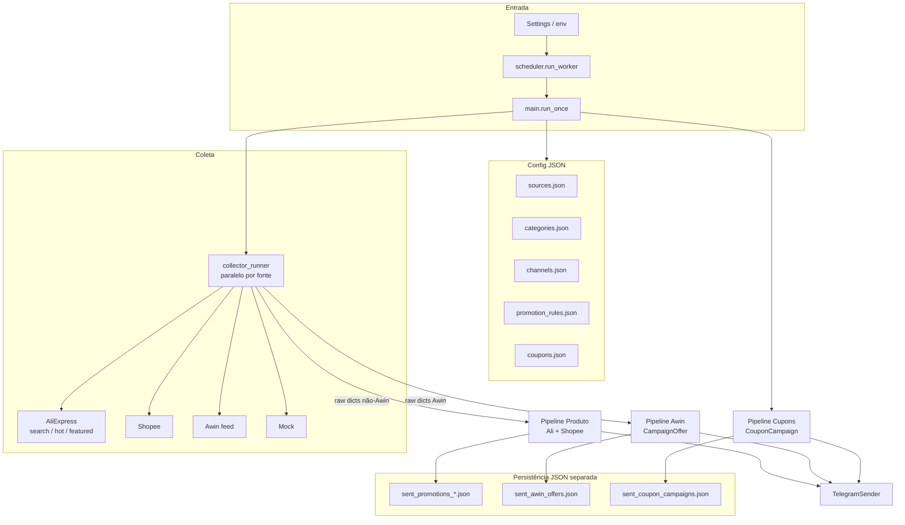
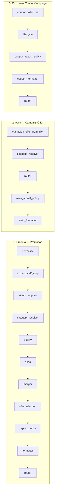
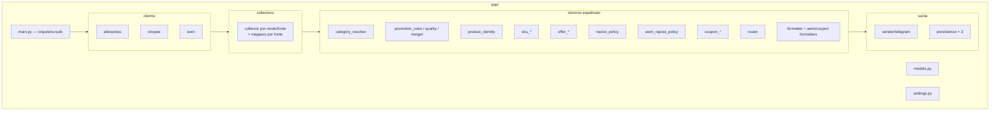

# Arquitetura — promoflash-bot

Documento da arquitetura **atual do código** (como o worker funciona hoje).

## Visão geral

Worker Python orquestrado por `app/main.py`. A cada ciclo (`run_once`):

1. carrega config JSON + settings;
2. monta clients e collectors;
3. coleta em paralelo por fonte (`collector_runner`);
4. despacha o resultado em **três pipelines de publicação** distintos;
5. envia via Telegram e persiste snapshots em JSON separados.

Não há um único funil de domínio. Há **três modelos e três caminhos** que compartilham Telegram, router e category resolver, mas têm regras, formatters e persistência próprios.

## Os três pipelines

### 1. Pipeline de produto (`Promotion`)

Fontes: AliExpress (product search, hot products, featured promotions) e Shopee.

Fluxo típico em `_run_product_pipeline`:

- `normalize` → `Promotion`
- expansão/agrupamento de SKU (AliExpress, opcional)
- anexar cupons de produto (`coupon_pipeline`)
- `category_resolver` (score FTS-like em memória)
- quality + `promotion_rules`
- merger de duplicatas
- seleção/diversificação de ofertas
- antirrepost (`repost_policy`)
- `formatter` → `router` → Telegram
- persistência por fonte em `data/sent_promotions_*.json`

### 2. Pipeline Awin (`CampaignOffer`)

Itens com `source=awin` saem da coleta comum e vão para `_run_awin_pipeline`:

- conversão para `CampaignOffer`
- `category_resolver`
- router por kind/categoria
- antirrepost próprio (`awin_repost_policy`)
- `awin_formatter`
- persistência em `data/sent_awin_offers.json`

Não passa por normalizer de produto, SKU, quality/rules de Promotion nem merger do pipeline 1.

### 3. Pipeline de cupons (`CouponCampaign`)

Fluxo paralelo em `_run_coupon_campaign_pipeline`:

- collectors de campanha (manual, API AliExpress, etc.)
- lifecycle (validade / agendamento)
- antirrepost de campanha
- `coupon_formatter`
- router → Telegram
- persistência em `data/sent_coupon_campaigns.json`

Campanha de cupom pode existir **sem produto**. Cupom em produto (pipeline 1) é outro fluxo: anexo com vínculo explícito; ausência de cupom não invalida a promoção.

## Mapa de pastas

## Componentes

| Componente | Responsabilidade |
|---|---|
| **scheduler** | Modo `once` ou loop `worker` chamando `run_once` |
| **main** | Orquestra config, clients, coleta e os 3 pipelines |
| **settings** | Env (`APP_ENV`, tokens, intervalos, etc.) |
| **clients/** | HTTP/APIs AliExpress, Shopee, Awin |
| **collectors/** | Coleta bruta por fonte/modo + mappers |
| **collector_runner** | Coleta paralela entre fontes; sequencial dentro da fonte |
| **normalizer** | Raw dict → `Promotion` |
| **category_resolver** | Classificação interna (score FTS-like + dedupe de spans) |
| **product_identity** | Chaves de produto/oferta/preço |
| **sku_*** | Expansão, grouping e avaliação de SKUs AliExpress |
| **promotion_quality / promotion_rules** | Filtros de qualidade e curadoria |
| **promotion_merger** | Consolida duplicatas entre collectors |
| **offer_selection / offer_ranker / offer_grouper** | Escolha das ofertas a publicar |
| **repost_policy** | Antirrepost de produtos |
| **awin_repost_policy** | Antirrepost de ofertas Awin |
| **coupon_*** | Config, lifecycle, matcher, pipeline, formatter, persistência e antirrepost de cupons |
| **router** | Destinos Telegram por categoria/canal |
| **formatter / awin_formatter / coupon_formatter** | Texto da mensagem por tipo de item |
| **sender/** | Envio (Telegram; WhatsApp previsto) |
| **persistence / awin_persistence / coupon_persistence** | Histórico JSON de envios |

## Configuração e dados

| Arquivo | Uso |
|---|---|
| `config/sources.json` | Fontes/modos de coleta habilitados |
| `config/categories.json` | Termos/pesos/negativos por categoria interna |
| `config/channels.json` | Destinos por canal e categoria |
| `config/promotion_rules.json` | Regras de curadoria e `blocked_keywords` |
| `config/coupons.json` | Campanhas e vínculos manuais de cupom |
| `data/sent_promotions_*.json` | Histórico de produtos por fonte |
| `data/sent_awin_offers.json` | Histórico Awin |
| `data/sent_coupon_campaigns.json` | Histórico de campanhas de cupom |

## Características atuais (leitura do código)

- **`main.py` é o centro** — não há um “core pipeline” único reutilizável entre fontes.
- **Três modelos de publicação**: `Promotion`, `CampaignOffer`, `CouponCampaign`.
- **Políticas espelhadas por família**: repost / formatter / persistência repetidos com variações.
- **Fonte → código espelhado**: cada afiliado tende a ter client + collector(s) + mapper (+ extras AliExpress: SKU, coupons).
- **Config carrega muita regra de negócio**; o código ainda cresce em volta de cada fonte e modo de coleta.
- Category resolver é compartilhado (produto e Awin), com score em memória (sem banco / sem LLM).

## Marcas

- **PromoFlash Bot** — nome técnico do bot/worker
- **Promos do Galeguinho** — marca pública/comunidade
- **Galeguinho** — personagem/comunicador da marca
